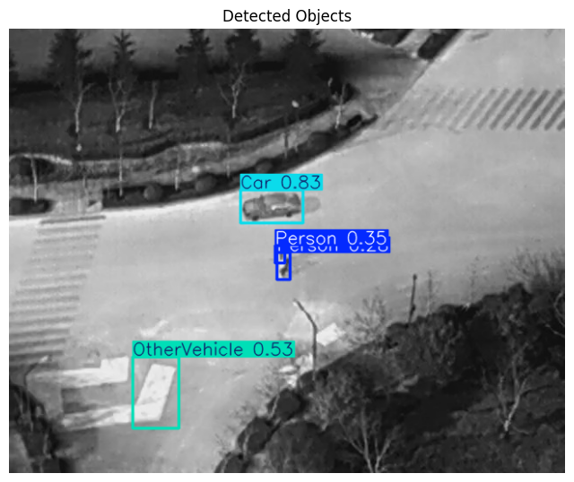
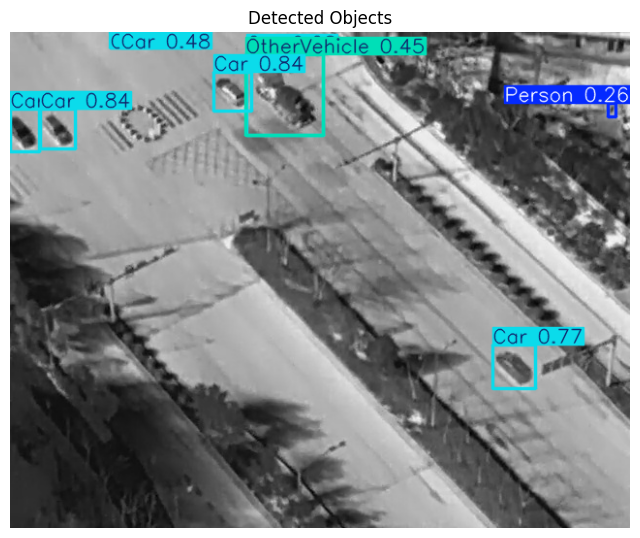
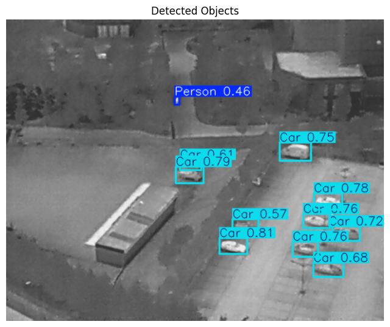
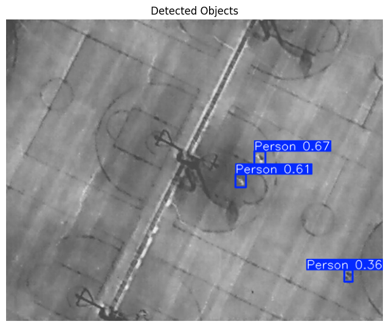

# 🚁 YOLOv8-Based Object Detection for Search and Rescue

This project implements a real-time object detection system using YOLOv8 to assist in search and rescue operations. The model detects and classifies objects like persons, vehicles, and bicycles from aerial imagery, enhancing response efficiency during emergency and disaster scenarios.

---

## 📌 Features
- Real-time detection using YOLOv8 variants (Nano, Small, Medium, Large, XLarge).
- Trained on a custom dataset containing five object categories.
- Optimized for UAV-based and edge device deployment.
- Supports aerial surveillance, search-and-rescue, and emergency response.

---

## 📂 Dataset Structure
```
BE_project/
├── images/
│   ├── train/
│   ├── val/
│   └── test/
├── labels/
│   ├── train/
│   ├── val/
│   └── test/
└── dataset.yaml
```

**Classes:**
- 0: Person
- 1: Car
- 2: Bicycle
- 3: OtherVehicle
- 4: DontCare

---

## 🚀 Getting Started

### Installation
```bash
pip install ultralytics
```

### Training the Model
```bash
yolo detect train \
  model=yolov8m.yaml \
  data=dataset.yaml \
  epochs=75 \
  imgsz=640 \
  batch=8 \
  device=0
```

### Inference
```bash
yolo detect predict \
  model=runs/detect/train/weights/best.pt \
  source=images/test/
```

---

## 📊 Model Performance (YOLOv8m - 75 Epochs)

| Class          | Precision | Recall | mAP@50 | mAP@50-95 |
|----------------|-----------|--------|--------|------------|
| All            | 0.783     | 0.715  | 0.765  | 0.501      |
| Person         | 0.879     | 0.826  | 0.886  | 0.478      |
| Car            | 0.953     | 0.935  | 0.982  | 0.748      |
| Bicycle        | 0.869     | 0.776  | 0.878  | 0.514      |
| OtherVehicle   | 0.673     | 0.750  | 0.723  | 0.634      |
| DontCare       | 0.540     | 0.286  | 0.357  | 0.130      |


---

## 🖼️ Example Outputs
Sample visualizations from the test set with bounding boxes and labels (YOLOv8m).

<p align="center">
  
  
  <br><br>
  
  
</p>

---

## 🛠️ Future Enhancements
- Optimize the model for edge deployment on Jetson Nano/Raspberry Pi.
- Incorporate multimodal sensor fusion (e.g., RGB + IR).
- Expand dataset diversity to improve generalization.
- Implement alert system for critical object detection.

---

## 🙏 Acknowledgements
We thank our mentors and the research community for their guidance and open-source contributions, especially Ultralytics for the YOLOv8 framework.

---

## 📄 License
This project is intended for academic and non-commercial research purposes only.
